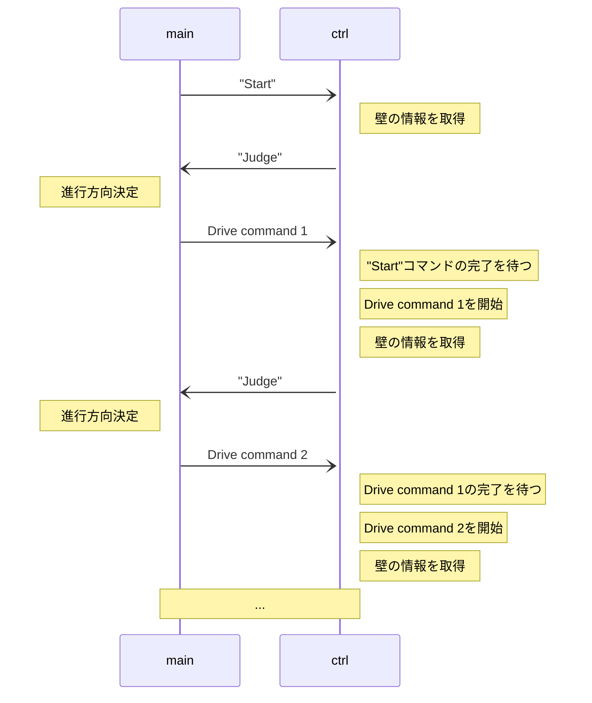

# micromouse-std-esp32

## Commands to control thread

||Command|Describe|Parameter|
|:-|:-|:-|:-|
|**Search run**|||
||SStart| Starts running from a standstill.|
||SForward| Forward 1 block|
||SReturn| Return|
||SRight| Turn right|
||SLeft| Turn left|
||SStop| Stop|
|**Try run**|||
||TBD||
|**Other**|||
||WSEnable|Set Enable/Disable each sensor|
||GyroCalibration|Calibrate the gyro|offset: f32|

## Response to main thread

|Response|Describe|Corresponding commands|
|:-:|:--|:--|
|CalibrationDone|Gyro calibration finished|GyroCalibration|
|Judge|Judge the next drive command|SStart, SForward, SReturn, SRight, SLeft|
|Stopped|The micromouse stopped|SStop|

### Search run

